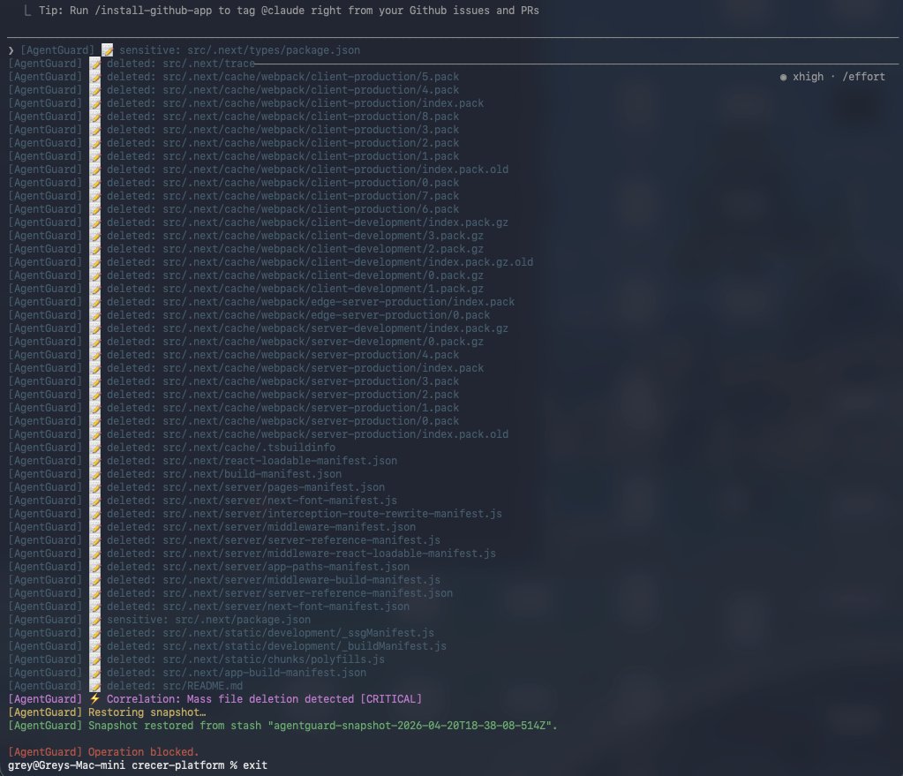
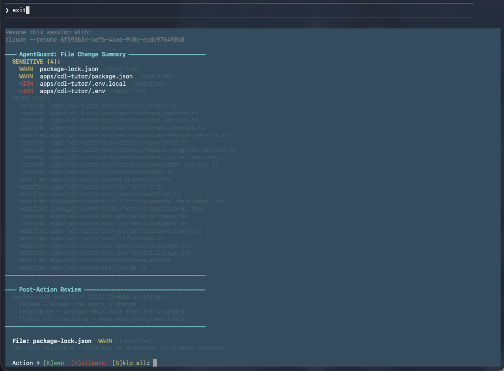

# Ilum

*formerly AgentGuard*

**Ilum — watches what your AI agents do.**

A terminal safety layer for AI coding agents.

Ilum wraps any CLI coding agent — Claude Code, Codex, aider — and watches what it does while it works. When behavior looks risky or out of scope, it intervenes: pausing execution, showing you a preview of what would happen, and asking for your approval before anything destructive continues.

It is **not an editor plugin**. It does not run inside VS Code or Cursor. It works in the terminal, where CLI agents actually execute.

---

## In action





---

## The problem

AI coding agents are powerful, but they routinely do more than you asked:

- running destructive commands you didn't expect (`rm -rf`, `git push --force`)
- editing files outside the intended scope (`.env`, CI configs, `package.json`)
- chaining several low-risk actions into a dangerous pattern
- writing to credentials, rewriting git history, or bumping engine requirements as a "helpful" side effect

The principle behind Ilum:

> **Do not block what you explicitly asked for. Catch the unintended side effects.**

---

## Real scenarios

### The `.env` incident

> *"Set up OpenAI integration in my app"*

The agent wired up the routes, created the client wrapper, added the import — then pulled `OPENAI_API_KEY=sk-proj-...` from earlier in the session and wrote it to `.env`.

Ilum surfaced the diff in the Post-Action Review. The key looked right, but it was an old key from a previous project, already rotated. Rolled back, set the correct key manually. Without the diff, that broken key would have shipped.

### The cleanup that wasn't

> *"Clean up unused files in /utils"*

The agent scanned, found files with no obvious imports, and queued `rm -rf ./utils/legacy`.

Ilum flagged it **CRITICAL** before the command ran. The directory stayed. A background job imports `legacy/pdf-parser.js` — nobody had touched it in eight months.

### The force push

> *"Fix the merge conflict in feature/payments and push"*

The agent resolved the conflict cleanly. Then it pushed with `git push --force`.

Ilum caught the command before execution. Three teammates had pushed to that branch that morning. A force push would have silently rewritten their work.

### The silent `package.json` edit

> *"Add rate limiting to the API"*

The agent installed `express-rate-limit` and wired it up correctly. It also bumped `engines` in `package.json` from `>=16` to `>=20` because the package uses modern syntax.

Ilum showed the diff in the Post-Action Review. The deployment environment was pinned to Node 18. That bump would have broken the next deploy.

---

## What it protects

Three defense layers run in parallel during every session.

### Layer 1 — Command interception

The agent runs inside a PTY wrapper (or a log-based fallback). Every shell command is classified before it executes. Risky commands pause the session and show an approval prompt with context:

```
┌───────────────────────────────────────────────────────┐
│  Ilum — CRITICAL RISK OPERATION                       │
├───────────────────────────────────────────────────────┤
│  Command:  rm -rf dist/                               │
│  Risk:     CRITICAL                                   │
│  Reason:   Recursive or forced file deletion          │
├───────────────────────────────────────────────────────┤
│  Files that would be deleted:                         │
│    dist/index.js                                      │
│    dist/bundle.css                                    │
├───────────────────────────────────────────────────────┤
│  [A] Approve   [D] Deny   [Q] Quit session            │
└───────────────────────────────────────────────────────┘
```

30+ built-in rules cover the most common destructive patterns. CRITICAL incidents are denied automatically by default.

### Layer 2 — File watcher

Monitors the filesystem in parallel using chokidar. Catches changes that bypass shell interception — Claude Code in `--print` mode writes files directly without going through a shell command.

After the session ends, a **Post-Action Review** walks through every sensitive file that changed, shows a colorized diff, and lets you keep or roll back each one from the snapshot.

### Layer 3 — Correlation rule engine

Watches for dangerous *combinations* of events within a time window. Six built-in rules:

| Rule | Pattern | Window |
|---|---|---|
| `env-plus-network` | Secret file written → network request | 30 s |
| `mass-delete` | 3+ file deletions | 20 s |
| `force-push-after-delete` | File deletion → force git push | 60 s |
| `env-overwrite` | Secret or credential file overwritten | 10 s |
| `shell-pipe-exec` | Pipe-to-shell pattern | 10 s |
| `dependency-change-plus-network` | Dependency file changed + network activity | 60 s |

CRITICAL correlation incidents block the session the same way command incidents do. A suppression system prevents repeated alerts for the same rule within its detection window.

### Memory security scanner

Agents read instructions from memory files — `CLAUDE.md`, `.cursorrules`, `.aider.*`, and the contents of `.claude/` and `.hermes/` directories. A poisoned memory file is a prompt-injection vector: it can silently steer an agent into exfiltrating secrets or running destructive commands in a later session.

When a watched memory file is created or modified, Ilum reads its content and scans for prompt-injection and poisoning patterns. A hit escalates the event to **CRITICAL**, so it flows through the audit log, the severity threshold, and every alert channel — surfacing a tampered instruction file before the next agent run picks it up.

---

## Severity levels

| Level | Default behavior |
|---|---|
| `CRITICAL` | Auto-denied, session terminated, snapshot restored |
| `HIGH` | Approval prompt shown, session paused |
| `WARN` | Approval prompt shown |

CRITICAL incidents are never quietly deferred. If there is no interactive TTY (CI environment, piped output), Ilum denies and terminates rather than allowing the session to continue.

---

## Approval preview

Before showing the prompt, Ilum builds a context preview sized for the terminal:

| Situation | Preview content |
|---|---|
| `rm` command | Files that would be deleted |
| Write to `.env` or config file | Current file contents |
| `git reset --hard` | `git diff --stat HEAD` — changes that would be lost |
| `git push --force` | Recent commits at risk |
| Correlation incident | Rule ID, detection pattern, event sources |
| File watch incident | Event type (created / modified / deleted) + file path |

---

## Snapshot and restore

At the start of every session, Ilum runs `git stash -u` to capture the full working tree. When an incident is denied, the snapshot is restored automatically before the session terminates — regardless of whether the deny was triggered by autoDeny, a no-TTY CRITICAL, or an interactive choice.

Restore result (success or failure) is written to the audit log as a `snapshot_restore` event.

Snapshot is skipped when: the directory is not a git repository, the working tree is already clean, or `snapshot.enabled` is `false` in config.

---

## Install

**Requires Node.js 18 or later.** Git is strongly recommended — snapshot and rollback require it.

```bash
npm install -g ozilum
```

The CLI is published on npm as [`ozilum`](https://www.npmjs.com/package/ozilum). After install, the `ilum` command is on your `PATH` (the `agentguard` command is also installed as an alias for backward compatibility).

To work from source (track `main`, hack on rules, etc.):

```bash
git clone https://github.com/Osva2023/Ilum
cd Ilum
npm install
npm link
```

`node-pty` native bindings compile during `npm install` via `node-gyp`. If the build fails, Ilum falls back to log-based interception automatically — no extra configuration needed.

### First-run setup

```bash
agentguard init
```

An interactive wizard that:

1. Asks which directories to watch (defaults to the current directory)
2. Asks which agents you use — `claude`, `codex`, `aider`, `cursor`
3. Offers to add shell aliases to `~/.zshrc` (e.g. `alias claude='agentguard claude'`)
4. Offers to install the background daemon via launchd (macOS)
5. Writes `~/.agentguard/config.json` and prints a summary

Every step is optional — press Enter to skip. Existing config is preserved (it asks before overwriting) and aliases already declared in `~/.zshrc` outside the managed block are never shadowed.

---

## Usage

```bash
agentguard <agent> [agent-args...]
```

**Examples:**

```bash
# Claude Code
agentguard claude --print "refactor my auth module"

# Codex
agentguard codex

# aider
agentguard aider --model gpt-4
```

**What happens at startup:**

1. Config loaded from `agentguard.config.json` (project) or `~/.agentguard/config.json` (global)
2. Git snapshot created (`git stash -u`) — your rollback point
3. Agent launched inside the interceptor
4. Commands and file changes monitored until the agent exits
5. Post-Action Review runs if any sensitive files changed
6. Session summary printed

**Help:**

```bash
agentguard --help
```

**Local web dashboard** (audit log + session stats):

```bash
agentguard dashboard
```

---

## Background daemon

Ilum can run as a persistent file-watcher daemon that monitors configured directories without an active agent session. It uses audit-only mode (no prompts, no enforcement, no Telegram alerts) and writes every sensitive file change to `~/.agentguard/audit.log`.

```bash
agentguard daemon start      # launch in the background (detached)
agentguard daemon stop       # SIGTERM the running daemon, wait for clean exit
agentguard daemon status     # show PID, uptime, watched paths
agentguard daemon logs       # tail -f ~/.agentguard/daemon.log

# macOS — auto-start on login via launchd
agentguard daemon install    # write plist to ~/Library/LaunchAgents and load it
agentguard daemon uninstall  # unload and remove the plist
```

The daemon reads `watchPaths` from `~/.agentguard/config.json`:

```json
{
  "watchPaths": [
    "~/projects/app",
    "/etc/myservice"
  ]
}
```

Under launchd the daemon is registered as `com.agentguard.daemon` with `RunAtLoad=true` and `KeepAlive=true`, so it starts on login and restarts on crash. While installed, `daemon stop` only kills the process — launchd respawns it. Use `daemon uninstall` to actually disable it.

---

## Team Plan

A single developer watches one machine. A team watches all of them in one place.

With a team server configured, the daemon forwards every event it logs to a central server, tagged with the machine's hostname. Multiple machines report to the same server, and a shared web dashboard shows the combined activity from every machine in real time.

**How it works:**

- Each daemon keeps writing to its own local `~/.agentguard/audit.log` exactly as before.
- After every logged detection, it also `POST`s the event to your team server — **fire-and-forget**, with a short timeout, so syncing never blocks or slows the daemon. If the server is unreachable, local logging is unaffected.
- Each event carries `os.hostname()`, so the dashboard can group and filter by machine.
- The dashboard is a web page served by the team server — open it in any browser, from anywhere.

**Configure it** in `~/.agentguard/config.json`:

```json
{
  "team": {
    "serverUrl": "https://ilum-team.up.railway.app",
    "token": "your-shared-team-token"
  }
}
```

Both fields are required to enable syncing — leave either empty and the daemon stays fully local (no-op). The `token` must match the `AGENTGUARD_TOKEN` configured on the server. `agentguard daemon status` shows `Team sync: ✓ connected to <serverUrl>` when it's active.

The server itself lives in `agentguard-server/` — an Express + SQLite app that you deploy once (e.g. on Railway) and point every machine at.

---

## Team Dashboard

The team server serves a web dashboard at its root URL — for example:

```
https://ilum-team.up.railway.app
```

It shows events from **all** reporting machines together:

- A **machine selector** — view everything, or filter to a single hostname
- A **time-range filter** — today, last 7 days, last 30 days
- An **event table** — time, machine, file/command, severity badge, and event type
- Live **counters** — total events in range and number of active machines
- **Auto-refresh** every 10 seconds

Access is gated by the same team token (entered once in the browser and kept locally), so only people with the token can read the team's activity.

---

## Menu bar app (macOS)

Ilum ships with a small Electron tray app that lives in the macOS menu bar. It surfaces daemon liveness at a glance and gives you one-click access to start, stop, and inspect activity — without dropping into a terminal.

```bash
agentguard tray              # launches the menu bar app (detached)
```

The tray installs its own Electron runtime under `tray/node_modules`, so the first run requires a one-time install:

```bash
cd tray && npm install
```

**Interaction model:**

- **Left-click** the shield icon → a 320×400 popup opens anchored under the icon, with:
  - A status pill (green `Running` / red `Stopped`)
  - The list of `watchPaths` from `~/.agentguard/config.json`
  - The 5 most recent daemon-originated audit entries (time, file, severity badge)
  - **View full report** — opens `agentguard report` in a new Terminal window
  - **Start daemon** / **Stop daemon** — toggles based on current state
- **Right-click** the icon → minimal context menu with daemon status and Quit
- The popup hides on blur (like a native menu bar item) and refreshes automatically when the daemon's state changes

Electron is declared as an `optionalDependency` of the root package, so global installs of `ozilum` do not pull it in unless the user opts into the tray.

---

## Audit-only mode

When you want to observe behavior before enabling enforcement — or if interactive prompts are too disruptive for your current workflow — run in audit-only mode:

```bash
# Via CLI flag
agentguard --audit-only claude --print "clean up this project"

# Or set in config
# agentguard.config.json:  { "auditOnly": true }
```

In audit-only mode:
- All incidents are detected and logged
- No prompts are shown
- No commands are blocked
- No snapshot restore is triggered
- The session summary shows "AUDIT-ONLY MODE" and "observed" instead of "intercepted"

This is useful for a first run on a new project, or for teams that want to understand what Ilum would flag before committing to enforcement.

---

## Configuration

Create `agentguard.config.json` in your project directory, or `~/.agentguard/config.json` globally:

```json
{
  "policy": "dev",
  "autoApprove": ["WARN"],
  "autoDeny": ["CRITICAL"],
  "auditOnly": false,
  "rules": {
    "disabled": [],
    "custom": [
      {
        "pattern": "deploy\\.sh",
        "level": "HIGH",
        "reason": "Deployment script"
      }
    ]
  },
  "snapshot": {
    "enabled": true,
    "restoreOnDeny": true
  },
  "auditLog": {
    "path": "~/.agentguard/audit.log"
  },
  "notifications": {
    "minLevel": "HIGH",
    "telegram": {
      "enabled": false,
      "botToken": "",
      "chatId": "",
      "extraChatIds": []
    },
    "email": {
      "enabled": false,
      "smtp": { "host": "", "port": 465, "user": "", "pass": "", "secure": true },
      "to": ""
    },
    "slack": { "webhookUrl": "" },
    "discord": { "webhookUrl": "" },
    "system": { "enabled": true }
  },
  "team": {
    "serverUrl": "",
    "token": ""
  }
}
```

| Field | Default | Description |
|---|---|---|
| `policy` | — | Named policy pack: `dev`, `strict`, or `ci` (see below) |
| `autoApprove` | `[]` | Risk levels to approve without prompting |
| `autoDeny` | `["CRITICAL"]` | Risk levels to deny without prompting |
| `auditOnly` | `false` | Log all incidents but take no enforcement action |
| `rules.disabled` | `[]` | Built-in rule IDs to skip |
| `rules.custom` | `[]` | Additional rules: `{ pattern, level, reason }` |
| `snapshot.enabled` | `true` | Create a git stash at session start |
| `snapshot.restoreOnDeny` | `true` | Restore snapshot when an incident is denied |
| `notifications.minLevel` | `"HIGH"` | Minimum severity that triggers out-of-band alerts |
| `notifications.telegram` | disabled | Telegram alerts with inline Keep / Rollback buttons |
| `notifications.email` | disabled | Informational SMTP email alerts (no rollback) |
| `notifications.slack` | disabled | Slack alerts via incoming-webhook URL |
| `notifications.discord` | disabled | Discord alerts via webhook URL |
| `notifications.system` | macOS on | Native macOS notifications for HIGH/CRITICAL |
| `team.serverUrl` | `""` | Central team server to sync events to (see Team Plan) |
| `team.token` | `""` | Bearer token matching the team server |

### Policy packs

Set `"policy"` to apply a behavior preset. Any other fields you set override the pack.

| Pack | `autoApprove` | `autoDeny` | Use case |
|---|---|---|---|
| `dev` | `["WARN"]` | `["CRITICAL"]` | Local development — WARN auto-approved, HIGH prompts, CRITICAL blocked |
| `strict` | `[]` | `["CRITICAL", "HIGH"]` | Security-sensitive work — only WARN prompts, everything risky is blocked |
| `ci` | `[]` | `["CRITICAL", "HIGH", "WARN"]` | CI pipelines — all risky commands fail the build immediately |

Precedence: **defaults → pack → your config**. Your explicit settings always win.

---

## Notifications

Beyond the in-terminal prompt and audit log, Ilum can push alerts out of band over several channels. Each is independent — enable any combination. `notifications.minLevel` (default `HIGH`) gates the noisy channels: only events at or above that severity are sent, while the audit log and terminal output always record everything.

| Channel | Config key | What it does |
|---|---|---|
| **Telegram** | `notifications.telegram` | Interactive alerts with inline **Keep / Rollback** buttons — act on a change from your phone. See [Telegram approval](#telegram-approval). |
| **Email** | `notifications.email` | Informational SMTP email per incident (no rollback). Set `smtp.host` + at least one `to` recipient. |
| **Slack** | `notifications.slack` | Posts to a Slack channel via an incoming-webhook URL. |
| **Discord** | `notifications.discord` | Posts to a Discord channel via a webhook URL. |
| **macOS native** | `notifications.system` | Native macOS notification banners for HIGH/CRITICAL detections. On by default on macOS; a no-op elsewhere. |

Telegram is the only interactive channel (it carries the Keep / Rollback actions). Email, Slack, Discord, and macOS notifications are informational — they tell you something happened so you can open the dashboard or terminal to act.

---

## Telegram approval

When Telegram is configured, every sensitive file change during a session sends an alert with two inline buttons:

- **✅ Keep** — accept the change.
- **↩️ Rollback** — restore the file from the session snapshot in-place.

### Setup

**1. Create a bot.** In Telegram, open a chat with [@BotFather](https://t.me/BotFather) and send `/newbot`. Follow the prompts to pick a name and username. BotFather replies with a token like `123456789:ABCdefGhIJK-lmnoPQRstUVWXyz` — that is your `botToken`.

**2. Get your chat ID.** Open a chat with your new bot and send any message (e.g. `/start`). Then visit:

```
https://api.telegram.org/bot<YOUR_TOKEN>/getUpdates
```

In the JSON response, find `"chat":{"id":987654321,...}`. That number is your `chatId`. (If `result` is empty, send another message to the bot and refresh.)

**3. Save the credentials.** Add them to `~/.agentguard/config.json` (create the file if it doesn't exist):

```json
"notifications": {
  "telegram": {
    "enabled": true,
    "botToken": "123456789:ABCdefGhIJK-lmnoPQRstUVWXyz",
    "chatId": "987654321",
    "extraChatIds": []
  }
}
```

`extraChatIds` is optional — additional Telegram user IDs (as strings) authorized to act on the same alerts (e.g. teammates).

Or skip the config file and set env vars instead: `AGENTGUARD_TELEGRAM_BOT_TOKEN`, `AGENTGUARD_TELEGRAM_CHAT_ID`.

**Rollback** is per-file (not session-wide). It tries `git checkout stash@{N} -- <path>` for tracked files, `stash@{N}^3` for untracked-in-stash files, then falls back to a copy from `~/.agentguard/snapshots/{sessionId}/<path>` for gitignored files like `.env`. The stash is never popped — multiple files can be rolled back independently. If no source succeeds, the buttons stay live for retry.

**Authorization**: only Telegram user IDs in `chatId` + `extraChatIds` can press the buttons. Other presses are rejected.

**Session end**: unresolved alerts are marked **⌛ Session ended — no action taken** and their buttons cleared automatically.

---

## Audit log

All enforcement events are written as JSON-lines to `~/.agentguard/audit.log`:

```jsonl
{"ts":"2026-04-09T10:00:00.000Z","sessionId":"a1b2c3d4","event":"session_start","agent":"claude"}
{"ts":"2026-04-09T10:00:05.123Z","sessionId":"a1b2c3d4","event":"incident_detected","source":"command","level":"CRITICAL","reason":"Recursive or forced file deletion","command":"rm -rf dist/","agent":"claude"}
{"ts":"2026-04-09T10:00:05.456Z","sessionId":"a1b2c3d4","event":"incident_denied","source":"command","level":"CRITICAL","reason":"Recursive or forced file deletion","command":"rm -rf dist/","agent":"claude"}
{"ts":"2026-04-09T10:00:05.501Z","sessionId":"a1b2c3d4","event":"snapshot_restore","restored":true,"message":"Snapshot restored from stash \"stash@{0}\".","agent":"claude"}
{"ts":"2026-04-09T10:01:00.789Z","sessionId":"a1b2c3d4","event":"incident_detected","source":"correlation","level":"CRITICAL","ruleId":"env-plus-network","reason":"Secret file modified then network request","agent":"claude"}
{"ts":"2026-04-09T10:02:00.000Z","sessionId":"a1b2c3d4","event":"session_end","agent":"claude"}
```

Query with `jq`:

```bash
# All denied incidents
jq 'select(.event == "incident_denied")' ~/.agentguard/audit.log

# CRITICAL incidents only
jq 'select(.level == "CRITICAL")' ~/.agentguard/audit.log

# Correlation rule fires
jq 'select(.source == "correlation")' ~/.agentguard/audit.log

# Snapshot restores (success and failure)
jq 'select(.event == "snapshot_restore")' ~/.agentguard/audit.log
```

---

## Scope & boundaries

Ilum infers behavior from visible terminal output and filesystem changes. Knowing where that visibility ends tells you where to keep your own attention.

**Command interception varies by agent architecture.** The defense layers have different reach depending on how an agent runs:

| Layer | Claude Code | Codex | Copilot CLI |
|-------|-------------|-------|-------------|
| Command interceptor (PTY) | Partial — catches narrated commands | No — Rust binary | No — TUI bypasses PTY |
| File watcher | ✓ Works | ✓ Works | ✓ Works |
| Post-Action Review + rollback | ✓ Works | ✓ Works | ✓ Works |

The file watcher and Post-Action Review are the primary defenses and work across all agents. Real-time command interception is best-effort and agent-dependent.

**No kernel-level visibility.** Ilum does not monitor OS-level events (`execve`, `unlink`, `openat`, `connect`). It works from terminal output and filesystem changes, not from what executed at the OS level.

**File monitoring is scoped to the host filesystem.** The file watcher sees changes under the watched path on the host. Changes inside isolated containers that are not bind-mounted, or non-file side effects (database writes, cloud API calls), are outside its view.

**Rollback is git-based.** Snapshot restore uses `git stash`. If the directory is not a git repo, or the working tree was already clean, there is no snapshot to restore. Rollback reverts files, not external side effects — cloud resources, third-party API calls, database mutations.

---

## What Ilum does not do

- It is not an IDE plugin or editor extension
- It does not replace code review
- It does not make all destructive changes impossible
- It cannot revert cloud resources, database writes, or external API calls
- It does not understand your intent — it detects patterns, not meaning

Human judgment is still required. Ilum improves real-time visibility into autonomous agent behavior; it does not eliminate the need to pay attention.

---

## Architecture

```
agentguard [--audit-only] <agent> [args]
        │
        ├── loadConfig()            agentguard.config.json → policy pack → defaults
        ├── createSnapshot()        git stash -u  →  stashRef
        │
        ├── PTY interceptor         node-pty (preferred when TTY available)
        │   or log interceptor      fallback: no TTY, no native build, CI
        │       │
        │       ├── decodeCommand() raw output line → canonical event
        │       ├── event-bus       time-windowed in-memory event buffer
        │       ├── correlator      6 multi-event correlation rules
        │       ├── suppression     cooldown — no repeat alerts within window
        │       └── handleIncident()
        │               │
        │               ├── auditOnly? → log only, resume
        │               ├── autoDeny  → log denied → restore → terminate
        │               ├── autoApprove → log approved → resume
        │               ├── no TTY + CRITICAL → deny path
        │               └── prompt  → buildIncidentPreview() → promptApproval()
        │
        ├── startFileWatcher()      chokidar — parallel filesystem monitoring
        │       └── decodeFileEvent() → shared event-bus (cross-layer correlation)
        │
        └── showPostActionReview()  per-file diff + keep / rollback after session
```

---

## Development

```bash
# Run all tests
npm test

# Run individual test suites
node --test test/enforcement.test.js
node --test test/correlator.test.js
node --test test/snapshot-restore.test.js
node --test test/audit-only.test.js
node --test test/policy-packs.test.js
node --test test/decoder.test.js
node --test test/suppression.test.js
node test/classifier.test.js
node test/config.test.js
```

**338 tests across 92 suites, 0 failures.**

Stack: Pure Node.js ESM, no TypeScript, no build step.
Runtime: `chalk`, `chokidar`, `express`, `nodemailer`; `node-pty` and `electron` are optional. Dev: `jest`.

### Releasing

Bump the version, publish to npm, then commit and push the version bump:

```bash
npm version 1.0.0 --no-git-tag-version
npm publish
git add package.json
git commit -m "chore: release 1.0.0"
git push
```

`npm version` rewrites `package.json` without creating a git tag; the explicit `git commit` keeps the release commit's message style consistent with the rest of the history.

---

## Contributing

Issues and feedback are welcome. If something broke, confused you, or should exist and doesn't, open an issue.

If you want to submit a PR: fork, branch, make the change, add a test if it touches logic, open the PR.

---

## License

[MIT](./LICENSE)
